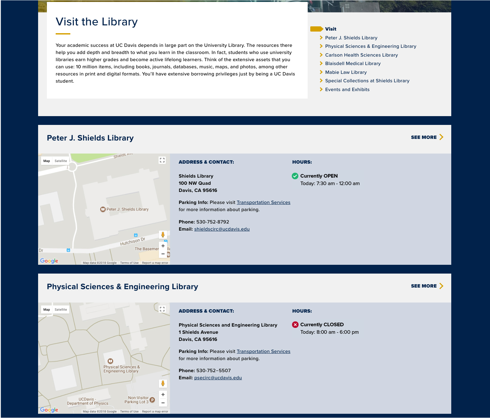

# Hours Element for Library Repeater Page
Polymer V3 element for displaying if a library is open today on the repeater page:
```html
<library-hours-single
    endpoint="googlecal.endpoint"
    key="api-key"
    search_term="id of lib dept found in event description">
</library-hours-single>`.
```

As referenced in [ucd-lib issue #381](https://github.com/UCDavisLibrary/ucd-lib/issues/381)


## Setup and Function
This element uses the [iron-ajax](https://www.webcomponents.org/element/PolymerElements/iron-ajax) element to query the Google Calendar API and retrieve and display open hours for the current day (pacific time). Since we are only using a public api key to authenticate, Google calendars must be public.

This element is considerably more limited and thus lightweight than the other hours elements ([week display](https://github.com/UCDavisLibrary/ucd-library-hours-week) & [front-page display](https://github.com/UCDavisLibrary/ucd-library-hours-today)). For example, it does not retrieve the full calendar data from Google (just today), and thus complex parsing functions are not needed. Additionally, it does not use a JSON file, but element attributes to initialize.
