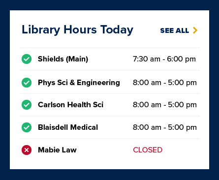

# Library Hours Index Element
Polymer V3 element for displaying todays library hours using
 ```html
<library-hours json_path='path/to/init/file.json'></library-hours>`.
```
As referenced in [ucd-lib issue #381 ](https://github.com/UCDavisLibrary/ucd-lib/issues/381)



## Setup and Function
This element uses the [iron-ajax](https://www.webcomponents.org/element/PolymerElements/iron-ajax) element to query the Google Calendar API and retrieve and display open hours for the current day (pacific time). Since we are only using a public api key to authenticate, Google calendars must be public.

In order to accommodate multiple library departments on a single calendar, an unique id must be assigned for each event series (department) and placed somewhere in the Google Calendar event description field. This id should also be set as the search term property in the event_series field of the init json file along with other relevant API parameters. An example json init file is below:
```json
[{"ajax_id": "lib_shields",
    "url":"https://www.googleapis.com/calendar/v3/calendars/ucdavis.edu_3dtim9248ptf2af2jfpqi6q4fc@group.calendar.google.com/events",
    "params": {"key": "your_public_api_key"},
    "event_series": [{"title": "Peter J. Shields", "search_term": "shields_main", "type": "library", "url": "https://www.library.ucdavis.edu/library/peter-j-shields/"},
        {"title": "Special Collections", "search_term": "spe_col", "type": "department", "url": "https://www.library.ucdavis.edu/service/researchsupport/"}]
    },
    {"ajax_id": "lib_pse",
        "url":"https://www.googleapis.com/calendar/v3/calendars/ucdavis.edu_j9puvf3qfd2jcj86vpq5nqjmlg@group.calendar.google.com/events",
        "params": {"key": "your_public_api_key"},
        "event_series": [{"title": "Physical Sciences & Engineering Library", "search_term": "pse_main", "type": "library", "url": "https://www.library.ucdavis.edu/library/physical-sciences-engineering/"}]
    }]
```

Like the [repeater hours element](https://github.com/UCDavisLibrary/ucd-library-hours-single), this element only retrieves events for the current day via API.
